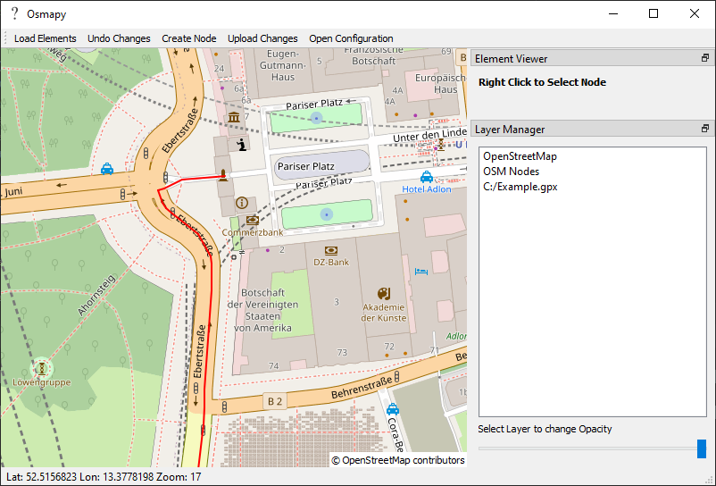
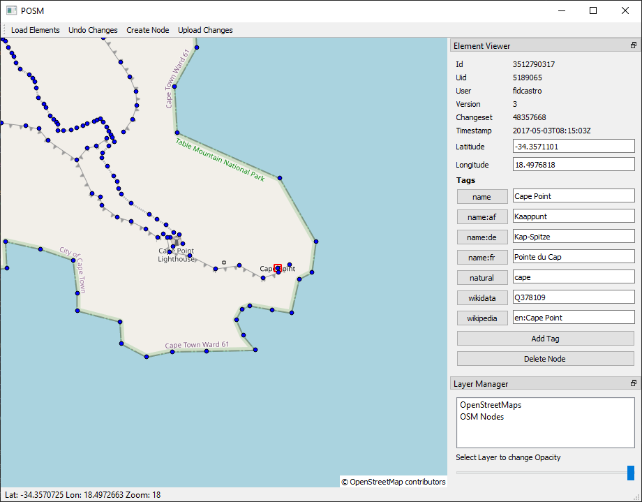

# Osmapy - Python Editor for OpenStreetMap Data

May I introduce you to __Osmapy__, the Editor for [OpenStreetMap](https://www.openstreetmap.org) data written in Python.
This should become the new state of the art editor for OpenStreetMap.
In contrast to the other common OSM editors this editor is based on Python.
Python is modern, has a huge user base and is battery-included.
This allows everyone to contribute to this project.
Osmapy uses the widespread, powerful and freshly-looking Qt-framework.

OpenStreetMap is a trademark of the OpenStreetMap Foundation, and is used with their permission. Osmapy is not endorsed by or affiliated with the OpenStreetMap Foundation.





Currently Osmapy is more like a prove of concept than a full fledged editor.
But it can already be used to modify OSM nodes.

## Features
The following Features are already implemented:
 * Interface to Slippy Tiles
    * LiFo queue to load the most needed tiles first
    * Multiple workers to download tiles
    * Caching
    * Easy configuration to chose tile servers
 * Layers
    * Multi-Layer support
    * Change layer order by Drag'n'Drop
    * Change the opacity of layers
 * GPX files
    * GPX files are easily loaded by Drag'n'Drop
 * OSM objects modification
    * Create / Modify / Delete OSM nodes
    * Add / Change / Remove Tags
    * Precise node moving with the arrow keys
    * Upload your changes to the OSM server
 * Adaptive appearance
    * All the tool windows can be moved around freely
 * Easy configuration
    * Just one YAML file must be modified

## Installation

Maybe you have to install the  [Build Tools for Visual Studio](https://visualstudio.microsoft.com/downloads/) on Windows.

The editor can be easily installed using pip:
```
pip3 install Osmapy
``` 

After installation run in the commandline:
```
Osmapy
```

## Development and Testing

Please use the [sandbox API](https://master.apis.dev.openstreetmap.org) for development and testing. You can set the API url in the configuration file.
```
osm_api_url: https://master.apis.dev.openstreetmap.org
```
    
## Small User Hints

 - Move around: Right mouse button + Mouse Move
 - Zooming: Mousewheel
 - After zooming in you can click on "Load Elements" to load the OSM elements in the visible area
 - Select Node with right click
 - Move selected Node with arrow keys
 - Remove OSM tag: click on the key of the tag
 - Drop GPX file into window to load it

# License
This software is released under the terms of the [GNU General Public License v3.0](LICENSE).
 
